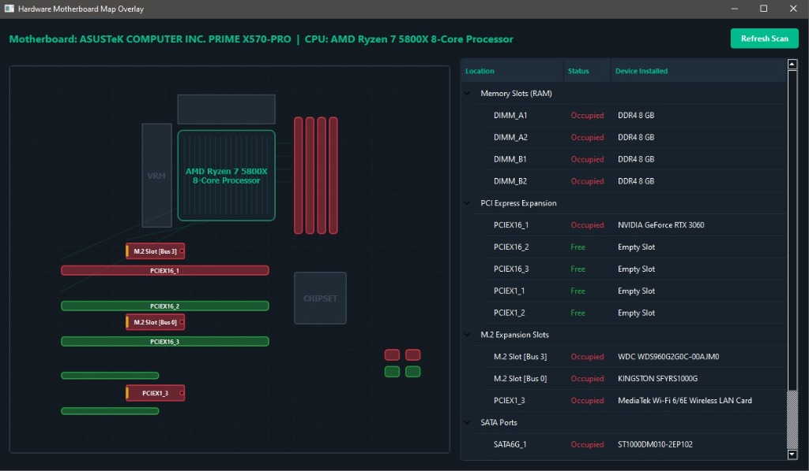

# Motherboard Resource Checker



**Motherboard Resource Checker** (v1.0.0) is a native desktop application written in C++ and Qt, designed to visually map a computer's motherboard, identify hardware expansion slots (RAM, PCIe, M.2, SATA), and show which ones are occupied along with the installed CPU model.

It is highly portable and optimized to run on legacy environments (such as Windows XP and Windows 7) as well as modern versions of Windows (10 and 11).

---

## 🛠️ Features

- **Interactive Motherboard Map**: Renders an interactive vector-style motherboard diagram highlighting all expansion slots (RAM, PCIe, M.2, SATA).
- **Low-Level Hardware Scanner**: Collects precise hardware details using native Windows APIs, WMI, and parsing raw SMBIOS/DMI tables.
- **PCIe Endpoint Identification**: Identifies the specific hardware devices (such as GPUs, NVMe drives, Wi-Fi cards) connected to each PCIe slot.
- **CPU Socket Display**: Detects and displays the full description of the installed processor (CPU) inside the visual socket.
- **100% Portable**: Bundled into a single, dependency-free `Motherboard Resource Checker.exe` of ~90MB. No installation required.
- **Retro-Compatibility**: Designed and compiled to be fully compatible with Windows XP, 7, 8, 10, and 11.

---

## 🚀 How to Run the Portable Executable

Just run:
- **`Motherboard Resource Checker.exe`**

Upon launch:
1. The embedded `miniz` decompression engine extracts the Qt dependencies silently into the user's `%TEMP%\Motherboard_Resource_Checker_App` folder.
2. The main application launches immediately.
3. Subsequent launches are instantaneous as the loader detects that the files have already been decompressed.

---

## 💻 Project Structure

The project files are organized as follows:

- `/src`: C++ source files (`.cpp` and `.h`).
  - `main.cpp`: Main application entry point.
  - `motherboard_map.*`: Visual motherboard widget and layout coordinator.
  - `slot_item.*`: Visual slots graphics painting with interactive hover events and tooltips.
  - `hardware_scanner.*`: Backend scanning subsystem (WMI, SetupAPI, SMBIOS).
  - `loader.cpp`: Standalone portable launcher implementing in-memory `miniz` ZIP decompression.
  - `miniz.*`: Lightweight, single-file C zip library.
  - `types.h`: Data structures and constants.
- `/resources`: Graphics assets, the system screenshot, and compiled `.rc` files.
- `mb_resource_checker.pro`: QMake project configuration file.
- `build.bat`: Automated MSVC compilation and packaging script.
- `.gitignore`: Configures Git to ignore intermediate compiler outputs, caches, and build binaries.

---

## 🛠️ How to Compile from Source

To compile the project manually on Windows, you must have the **MSVC compiler (Visual Studio)** and **Qt 5.15.2** installed.

1. Open the Developer Command Prompt for Visual Studio.
2. Navigate to the project root directory.
3. Run the build script:
   ```cmd
   .\build.bat
   ```
The script will automate the following:
* Sets up the MSVC compiler environment.
* Runs QMake and NMake to compile the main GUI app.
* Deploys Qt dependencies into the `release` folder via `windeployqt`.
* Compresses the release bundle into a `.zip` file.
* Compiles the resource script (`loader.rc`), embedding the ZIP file.
* Compiles the portable launcher using `loader.cpp` and `miniz.c`, linking it statically (`/MT`) into the final standalone `Motherboard Resource Checker.exe`.
